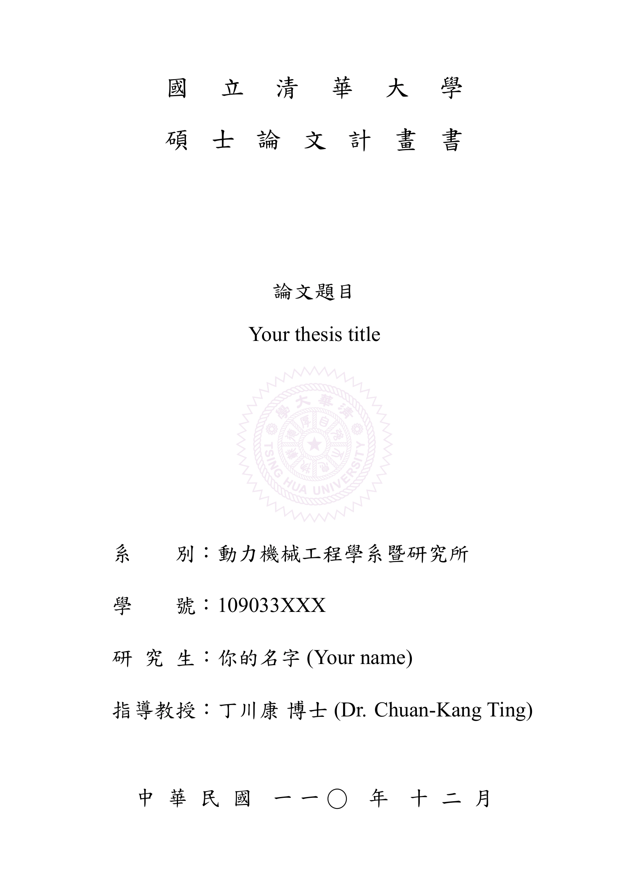

# CILab-Thesis-Cover-NTHU
Thesis cover setting with LaTex in overleaf.

## Usage
1. Upload files or .zip to overleaf.
2. Setting compiler as *XeLatex*.
3. Edit your information (name, topic, date, etc.) in *nthuvars.tex*.

## Author
* Yu-Wei Wu
* Meng-Huan Lu

## Credit
* 原版：https://github.com/HW-Lee/nthu-thesis-template
* 魔改：https://github.com/signxer/nthu-thesis-template-mod

## Template Preview

